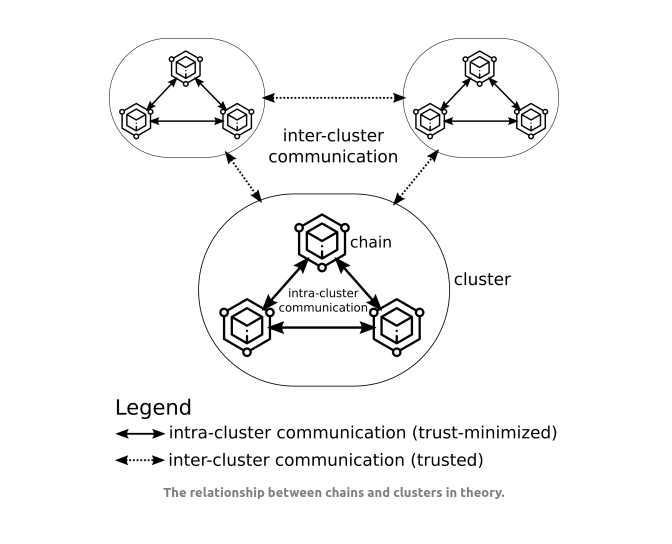

# Modular Bridges

The vast majority of generalized bridges out there today are *monolithic*. This means that they are tied to a specific verification mechanism that is implemented as a core part of the bridge construction.

Connext is the first example of a generalized crosschain messaging mechanism that is *modular*, plugging into the best available verification method for a given ecosystem. 

## Clusters

To understand why Connext is designed the way that it is, let us first explore the concept of [Clusters](https://blog.celestia.org/clusters/).

A cluster is a sovereign set of domains that share security and can communicate with one another using trust-minimized methods. For example, Ethereum and its rollups form a cluster. Cosmos chains are another cluster. Singular "monolithic" chains, such as Solana are also their own cluster.

In the [Message Verification](./verification.md) section, we broke down the different methods that exist to secure a message that travels between two domains. As we noted, the **best available mechanism** for verifying messages is different based on the specific pair of domains we want to communicate between. Another way to say this is that there is a *heterogenous* topology for message verification mechanisms across all networks.

For example, between a rollup and its L1, the most secure verification mechanism is to use the rollup bridge itself. 

:::caution
The security of a domain is always the security of its weakest link. This means that *any* method of passing messages to a rollup that isn't the rollup bridge introduces at least *some* trust assumptions and security overhead, which in turn weakens the benefit of using a rollup (vs a less secure domain such as a sidechain) in the first place.
:::

On the other hand, the most secure way to verify a message that passes between two discrete chains is a light client (zk or otherwise). Light client implementations exist in some places, but not everywhere yet - and it's highly unlikely that a single light client protocol will "win" every single pathway between sovereign chains.

## Pluggable Verification

Modular bridges make the verification layer (and potentially other parts!) of the [bridging stack](./what-is-a-bridge.md) pluggable. By doing this, they can leverage *existing* methods of message verification wherever possible. This gives the best possible security for applications that may want to interact with multiple (heterogenous) domains simultaneously. 