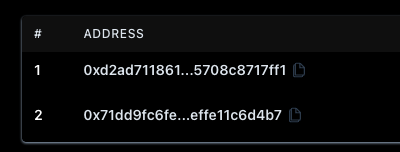
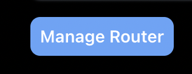
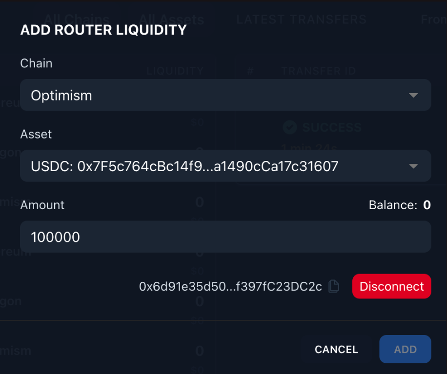

# Managing Your Router

Routers have three distinct roles for management:

1. *Router Signer* - The address associated with the private key that is available to the router at runtime to sign payloads which authorize liquidity to be used to facilitate cross-chain transfers. The *Router Signer* also has the ability to remove the router’s liquidity to the designated recipient.
    
    <aside>
    ⚠️ The *Router Signer* key is effectively a hot wallet that must be accessible by an internet-connected router at all times, making it the least secure key in the system. It is important to understand the ramifications of a key compromise and configure the other roles appropriately to mitigate risks.
    
    </aside>
    
2. *Recipient* - The address that will receive funds when liquidity is removed. Example secure options are: a DAO treasury, a secure multisig, a custodial centralized exchange account which you trust. Since this is only a receiver address, it is not required to be able to sign and send transactions (i.e. in the custodial case).
    
    <aside>
    ℹ️ There is an option to *not set* the recipient by setting it to `address(0)`. This will allow the `removeRouterLiquidity` functions to specify a recipient of their choice. This is a security risk and **not recommended** unless you are fully aware of the risks and have specific needs to do this.
    
    </aside>
    
3. *Router Owner* - The address that is able to set and change the *Recipient* address, as well as change itself to a different *Router Owner* address. The *Router Owner* can also remove the router’s liquidity to the designated recipient. This address should be a secure multisig, since it needs to be able to sign transactions to carry out the functionality.
    
    <aside>
    ℹ️ Router Ownership can be *burned* (set to `address(0)`). This is of course the most secure way to manage a router, but the implications are you can never change the designated recipient.
    
    </aside>
    

## Initialize a Router

Use this section if the router has never been initialized.

### Using the UI

Coming soon!

### Using the Smart Contract Directly

1. Use the Connext repo to find the deployments for the chain you want to set up the router on: 

[monorepo/packages/deployments/contracts/deployments at main · connext/nxtp](https://github.com/connext/monorepo/tree/main/packages/deployments/contracts/deployments)

1. Find the `Connext.json` deployment for that chain and copy the address.
2. Go to the website [louper.dev](https://louper.dev/) and enter the Connext contract address and choose the correct network.
3. Scroll to the `RoutersFacet` section and select the option for `WRITE` and connect with the *Router Signer* account.
4. Select the method `initializeRouter` and fill in the details for `_owner` and `_recipient` and execute the transaction.
5. Notify the Connext team to allowlist your router (this is still a permissioned role!).

<aside>
ℹ️ Note: This is the easiest way to call the contract function but since it is an onchain function it can be called from any mechanism to send the correct function with the appropriate arguments.

</aside>

## Modify Router Roles

Use these instructions to modify a router that has already been initialized.

### Using the UI

Coming soon!

### Using the Smart Contract Directly

1. Use the [above instructions](https://www.notion.so/Router-Management-b7deba54c150424c978aa6abd4fec7f6) to connect the *Router Owner* wallet to the Connext contract.
2. Use the functions `setRouterRecipient`, `proposeRouterOwner`, and `acceptProposedRouterOwner` on the `RoutersFacet` to modify the params as necessary.

## Remove Liquidity

### Using the UI

1. Navigate to the ‘Router’ tab on Connextscan 2.0 and click your router ID
    
    

2. Click ‘Manage Router, and remove funds using our ’Remove Liquidity’ UI feature

### Using the Smart Contract Directly

1. Use the [above instructions](https://www.notion.so/Router-Management-b7deba54c150424c978aa6abd4fec7f6) to connect the *Router Owner* wallet to the Connext contract.
2. Find the canonical `TokenId` by calling the `adoptedToCanonical` function on the `TokenFacet` and filling in the `_adopted` with the address of the token contract of the “adopted asset” (i.e. USDC).
3. With this information, call the `removeRouterLiquidity` function.