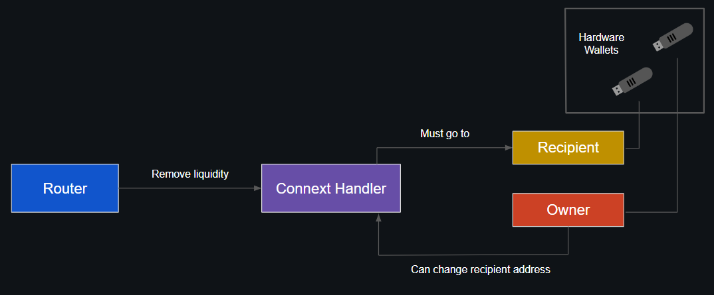

# Security
Being mindful of security is an essential part of operating any Web3 infrastructure, and running a Connext Router is no exception. Here are some things to be aware of:  

## Miscellaneous
#### Setting Recipient and Owner Addresses



In addition to its own signing address, each Router has a **Recipient** and **Owner** address set in the respective `Connext Handler` contracts of each chain.

- `Recipient`: Whenever you remove liquidity from the Router, the funds will always be sent to the **Recipient** address. If your Router were somehow compromised, at best the attacker would only be able to withdraw your funds to the Recipient address. We highly advise using a separate hardware wallet for this address.

- `Owner`: Only the **Owner** has the ability to change the Recipient and Owner addresses. Again, we recommend using a separate hardware wallet for this address.

The Recipient and Owner addresses can be changed by calling the corresponding write methods on the Connext Handler contract from the **Owner** address (`setRouterRecipient` and `proposeRouterOwner`/`acceptProposedRouterOwner`). This needs to be done on each chain supported.

It's strongly recommended that you set your Recipient and Owner addresses to something different from your Router's signing address. Since the Recipient and Owner private keys are not accessed by or stored on the Router, simply compromising your Router would not be enough for an attacker to access your liquidity -- they would also need control of the Recipient and/or Owner wallet.

Please keep in mind that each Router's Recipient and Owner addresses can be publicly queried from the Connext Handler contracts.

#### Protecting Your Admin Token

Each Router has an **Admin Token** -- an authorization string chosen by the operator and set in the `config.json` file.

The Admin Token is used to authenticate requests made to the Router's REST API endpoint and must be kept secret.

If your Router's API endpoint is left exposed to the public and your Admin Token is either compromised or vulnerable to brute forcing, someone could use your token perform unauthorized operations with your Router.

Use a sufficiently long token (50 characters or more) to protect against brute force attacks. You can easily generate a secure token using `pwgen` with the following command:

`pwgen -s 50 1`

The Admin Token is stored in plaintext in the Router's `config.json` file. You can follow the method below to load your **config.json** into **tmpfs** before starting the Router, and unmount it after the Router is started. Using this method will require you to generate and move your configuration into **tmpfs** on each Router restart. The old contents will be lost -- so don't forget to backup any important information first (eg: your wallet mnemonic!)

1. Create **tmpfs**:  
`mount -t tmpfs -o size=100m tmpfs /mnt/tmpfs`

2. Move config file to **tmpfs**:  
`mv config.json /mnt/tmpfs/config.json`

3. Change the volume point in docker-compose (use type [bind](https://github.com/docker/compose/issues/2781#issuecomment-441653347)):  
`- /mnt/tmpfs/config.json:/home/node/Router/config.json`

4. Run `docker-compose`

5. Finally, unmount the **tmpfs** dir. After this step all data in **/mnt/tmpfs/** will be lost:  
`umount /mnt/tmpfs`

#### Docker Overrides Iptables (UFW)

By default, Docker overrides any iptables (UFW) rules. If you're using the Docker Router image and your VM has a direct connection to the Internet, make sure you're not accidentally exposing your Router API endpoint externally.

**Example:**  
If UFW on our Router is configured to block all traffic on the  `ROUTER_EXTERNAL_PORT` (port **8000** by default), then we would expect the following to fail from an external machine:  

`curl http://x.x.x.x:8000/config`  

Instead, we receive a response indicating that the port is open.  

`{"signerAddress":"0x26Ad85....."}`

One simple solution to edit the `docker-compose.yml` file to bind the exposed port to **localhost**, by changing:

```
...
  ports:
    - $ROUTER_EXTERNAL_PORT:8080
...
```
to:
```
...
  ports:
    - 127.0.0.1:$ROUTER_EXTERNAL_PORT:8080
...
```

Restart the Docker-Compose stack after making the change. The endpoint should now only be available from the machine running the Router -- try again from an external machine to make sure the change was successful.

## Protecting Your Router's Private Key

Whenever you are joining a crypto project we advise that you should use a brand new wallet each time.
You can generate a private key using the following command:  
`openssl rand -hex 32 > private_key.json`  

Avoid operating your Router with your private key or mnemonic stored in plaintext. While it's possible to use a mnemonic in `config.json` or a raw key stored unencrypted in a `key.yaml` file, these should be considered for testing purposes only.

Instead, use one of the supported [Web3Signer methods](https://docs.web3signer.consensys.net/en/latest/HowTo/Use-Signing-Keys/). Using an external KMS that explicitly whitelists Web3Signer will allow you to move your private key out of plaintext and off your Router server entirely.

Web3Signer has native support for several key vaults and HSMs, as well as encrypted keystore files. Consult the [official docs](https://docs.web3signer.consensys.net/en/latest/Reference/Key-Configuration-Files/) to get started, or ask in our Discord server.

## Integrate web3signer

#### Example: Using Google Secrets Manager with Keystore Files
Web3Signer doesn't have built-in support for Google Secrets Manager, but we can use a strategy like the one below that combines Secrets Manager with an encrypted keystore file. Web3Signer expects the key password to be given in a text file. But instead of storing the password on our hard drive, we'll store it in Secrets Manager and write the needed file to *tmpfs* on demand, removing it again after Web3Signer has started and loaded the key into memory. This approach is a little more secure than storing the private key directly in Secrets Manager, because two pieces of information from two different sources are needed to learn the key. Also, the generated keystore (json) file is fully encrypted/portable and can be safely backed up or moved to a new VM as needed.
1. Grant your Web3Signer VM the needed permissions to read secrets.
2. Generate a secure password for your keystore file:  
`echo $(pwgen -s 50 1) > pwd.password`
3. Store the password in Secrets Manager.
4. Use the password file to generate a keystore file. For example, using [geth](https://geth.ethereum.org/docs/install-and-build/installing-geth):  
`geth account new --password pwd.password`  
You can copy the keystore file to a more convenient directory.
5. Securely delete the password file.  
`shred -uvz -n 3 pwd.password`
6. Create your key config file. Note that *keystorePasswordFile* refers to the directory inside the container:
```
type: "file-keystore"
keyType: "SECP256K1"
keystoreFile: "key.json"
keystorePasswordFile: "/home/node/signer/pwd/pwd.password"
```
7. Whenever we need to run Web3Signer, we'll retrieve the password from Secrets Manager directly to *tmpfs* first. We'll run the container using a bind mount for the password file (in *tmpfs*) and another for the directory containing the keystore json and config files, deleting the password file after the container has started and loaded the key into memory. See below:
```
# create tmpfs
sudo mkdir /mnt/tmpfs
sudo mount -t tmpfs -o size=100m tmpfs /mnt/tmpfs

# retrieve keystore password from Secrets Manager
echo $(gcloud secrets versions access --secret {name of your secret} latest) > /mnt/tmpfs/pwd.password

# run web3signer on port 9000
# bind mount password directory (tmpfs)
# second bind mount for keystore json and config files
docker run -d -p 9000:9000 --name web3signer \
-v {your config directory}:/home/node/signer \
-v /mnt/tmpfs:/home/node/signer/pwd \
consensys/web3signer:develop \
--config-file=/home/node/signer/config.yaml eth1

# should show 1 key loaded into memory and ready to to handle signing requests
echo $(docker logs web3signer | grep -o "Total signers (keys) currently loaded in memory: .")
echo $(docker logs web3signer | grep "Runner | Web3Signer has started")

# delete password file
rm -rf /mnt/tmpfs/pwd.password
sudo umount /mnt/tmpfs

# should now be 'file not found' in both cases
cat /mnt/tmpfs/pwd.password
docker exec web3signer cat /home/node/signer/pwd/pwd.password

```

## Best practices for generating and managing ssh-keys
Key based authentication for SSH is more secure than using a password. SSH keys help protect you against brute force attacks, and using public-key encryption is safer than sending passwords across the network.

#### Choosing a key type:
Ed25519 keys are recommended over RSA, since they offer better security and performance.  
`ssh-keygen -t ed25519 -a 100`  

If you still want to use RSA keys (eg: for compatibility reasons), use a minimum length of 4096 bits.  
`ssh-keygen -b 4096 -o -a 100`  

*-o specifies OpenSSH format, already implied for Ed25519*  
*-a 100 specifies 100 rounds of key derivation*  

When creating the key pair, protect it with a passphrase that's at least 15-20 characters long.

#### 2-Factor Auth for SSH
2-Factor authorization is an easy way to greatly increase your level of protection.
- Google Authentication Module links with the Authenticator App on your mobile device. Anyone attempting to login will need to provide both your SSH key and a 6 digit code from your linked app. The code is only valid once and changes every 30 seconds.
- An even more secure option is U2F authentication using a physical token -- for example a Yubikey that authenticates via USB or NFC

## Hardening ssh config
Consider making these changes in the SSH server config file, `/etc/ssh/sshd_config`. Don't forget to restart the SSH service for the changes to take effect.  
- Change the SSH port from the default of 22 to any other port (for example 9922) -- there are a lot of bots scraping on the Internet for port 22
- Disable SSH root login
- Disable password login, and disallow empty passwords (*PermitEmptyPasswords no*)
- Explicitly whitelist users for SSH access
- Set *AllowAgentForwarding*, *AllowStreamLocalForwarding*, and *X11Forwarding* to *no*
- Check that *IgnoreRhosts* is set to *yes* and *HostbasedAuthentication* is set to *no*

Rate-limiting (eg: **fail2ban**) can be used to time out an offending IP address after a certain number of failed login attempts. You can also use iptables (UFW) to restrict SSH access to only allow your public IP. (Be careful not to lock yourself out!)

## Hardening current docker-compose file

## How to create and use bastion instance for accessing routers infrastructure
Instead of allowing a direct connection from your Router to the Internet, it's more secure to place your sensitive components (eg: Router, Web3Signer) in a private subnet. Create a bastion server (aka: jump server) to access the subnet, and a NAT to allow the Router to access the Internet.

Many cloud providers have built-in support for features like private networks and Cloud NATs to make this easier to achieve.  
*AWS docs:* [Private Instances](https://aws.amazon.com/vpc/), [Cloud NAT](https://docs.aws.amazon.com/vpc/latest/userguide/vpc-nat-gateway.html)  
*GCP docs:* [Private VPC](https://cloud.google.com/data-fusion/docs/how-to/create-private-ip), [Cloud NAT](https://cloud.google.com/nat/docs/overview)

#### Private network deep dive:


As you can see in the diagram above, your Router doesn't expose an external IP address and can't be accessed directly. SSH access to the Router (or any other VMs in the private subnet) can only be done by connecting through the bastion. The Router accesses the Internet through NAT, using it as gateway.

Using this configuration is less prone to attacks that would compromise your Router host.

#### Connecting to the bastion securely:
How you use the bastion to connect to the private subnet is important.  

*Wrong: Connecting with an intermediate key pair*  
Don't under any circumstances store the SSH key to the Router on the bastion, like this:  
```
# from client, using first key pair
ssh [bastion external IP]

# from bastion shell, using second key pair
ssh [Router internal IP]
```
The bastion is our most exposed point and the last thing we want to do is store anything sensitive (like SSH keys) on it.

*Wrong: Using agent forwarding*  
You may have seen this method used and/or recommended:
```
# from client
ssh-add [path to key]
ssh -A [bastion external IP]

# from bastion shell (now using client's ssh agent)
ssh [Router internal IP]
```
In this example, we store the SSH key for Router access in the client's SSH-agent. SSH-agent is a helper process that stores keys in memory for later use by the main SSH process. Then we use the `-A` flag to pass a reference to the client SSH-agent (containing the key) to the bastion, to use as its own when connecting to the Router. This is better than the first example, since the bastion is not storing or directly accessing any private keys. But it's still not entirely secure because if someone gains root access to the bastion, they can read the reference to the client SSH-agent, hijack it for their own purposes, and have full access to the Router.  

*Right: Use TCP forwarding (ProxyJump)*  
A better approach is to SSH from the client to the bastion and then establish TCP forwarding to the Router. Thankfully, recent versions of OpenSSH have built-in support to make this easy for us:
```
# from client
ssh -J [bastion external IP] [Router internal IP]
```
The client authenticates both hops to the Router, so the bastion does not need to store or have even indirect access to any private keys.

#### Hardening the bastion

- To reduce the attack surface, disable any unnecessary services and only allow ingress on the SSH port/egress to the subnet. You can also disallow interactive shell access on the bastion.
- Apply the general SSH hardening tips from the section above
- By default, unattended-upgrades will not automatically reboot even if some updates require it. You can change this in the config file `/etc/apt/apt.conf.d/50unattended-upgrades` by setting **Automatic-Reboot** to true. You can also change **Automatic-Reboot-Time** to schedule the reboots for a certain time. You will also have to install the package *update-notifier-common* (if it's not already installed)

#### Teleport
As an alternative to OpenSSH, a great tool to directly access your host machine is [Teleport](https://goteleport.com/), which adds features like a web UI and certificate based authentication.
